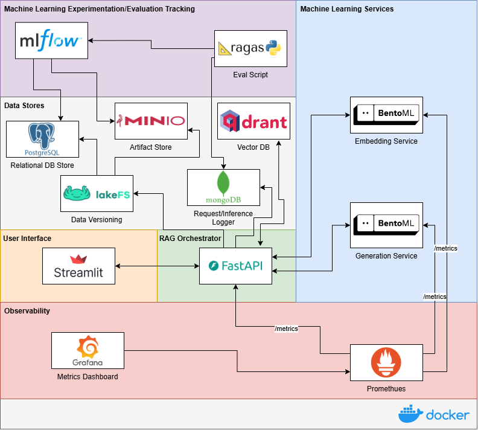

## What is this?

A **playground** for building and serving **Retrieval-Augmented Generation (RAG)** systems — with production in mind.

## Why?

To explore and apply best practices in **MLOps** and **LLMOps**, specifically around deploying modular, observable, and scalable RAG systems.

## What's Included?

- **FastAPI** orchestrator with `/ingest` and `/query` endpoints
- **BentoML** services for embeddings and generation
- **Qdrant** as the vector database for retrieval
- **MLflow** for experiment tracking
- **Prometheus** for monitoring core RAG metrics and model endpoints
- **Grafana** for visualising scraped metrics
- **Streamlit** app to interact with the system
- **MongoDB** for tracking user interaction and model outputs for model evaluation

## Goals

- Apply real-world deployment principles to RAG
- Track and monitor performance with Prometheus
- Structure services for modularity and scaling
