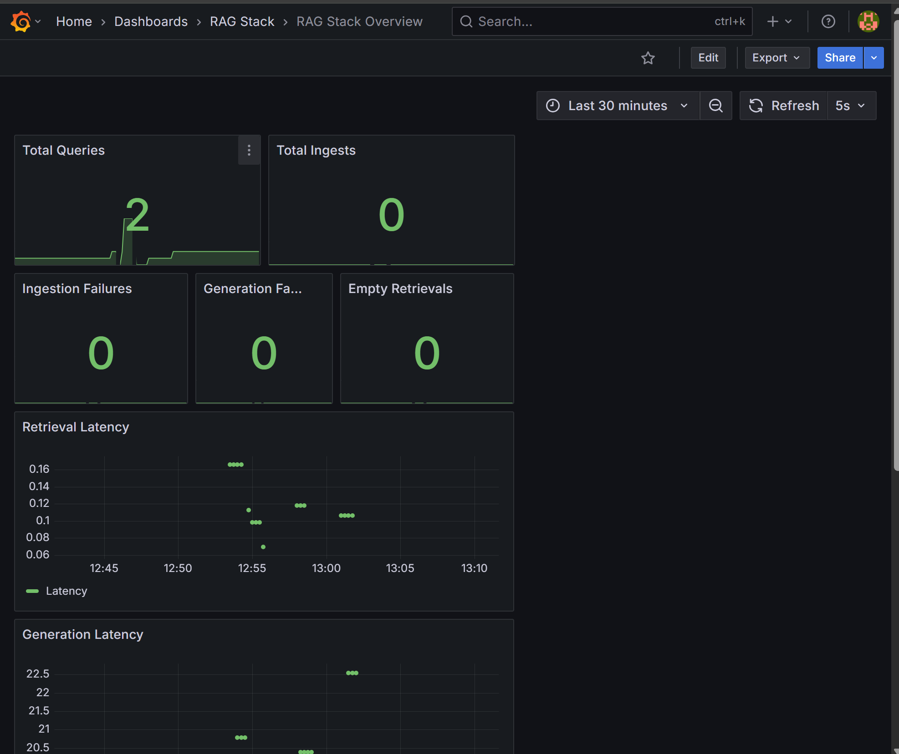
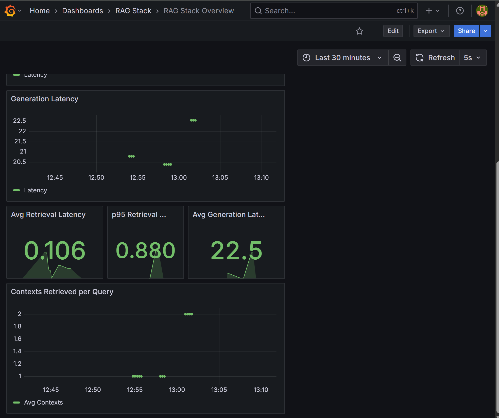

## What is this?

A **production-oriented** playground for building and serving **Retrieval-Augmented Generation0 (RAG)** systems.

## Why?

Designed to explore and apply best practices in **MLOps** and **LLMOps**, focusing on modular, observable, and scalable RAG system deployment.

## What's Included?


- **FastAPI** orchestrator with `/ingest` and `/query` endpoints
- **BentoML** services for embeddings and generation
- **Qdrant** as the vector database for retrieval
- **MLflow** for experiment tracking
- **Prometheus** for monitoring core RAG metrics and model endpoints
- **Grafana** for visualising scraped metrics
- **Streamlit** app to interact with the system
- **MongoDB** for tracking user interaction and model outputs for model evaluation

## Evaluation

User queries and model responses are stored together in MongoDB. This includes the question the user asked, the documents retrieved, and the models response.

This data enables offline performance evaluation using tools like Ragas, helping assess the quality and relevance of responses based on retrieval fidelity, factual grounding, and answer coherence.

Key evaluation criteria include:
- **Retrieval Precision** – Are the retrieved documents relevant to the query?
- **Groundedness** – Is the model’s answer supported by retrieved content?
- **Factual Consistency** – Does the response reflect the source documents accurately?
- **Completeness** – Does the answer fully address the original question?

Evaluation runs are registered inside MLflow, allowing you to:

- Track evaluation metrics over time
- Compare performance across different model versions or retrieval strategies

## Observability

This system includes end-to-end observability using Prometheus for metrics collection and Grafana for visualisation.

**Key Metrics tracked:**
- Ingestion latency
- Query processing time
- Model response health
- Vector search performance
- User interaction events

 **Example Dashboard**
<p float="left">
  
  
</p>

The dashboard offers visibility into system performance and model behavior during both ingestion and query stages.

It can also be extended to include the metrics provided from the BentoML endpoints.

## Getting Started

All components are containerised with Docker and orchestrated using Docker Compose.


Run

```bash
docker-compose up --build
```

The BentoML services can take some time to spin up.

Then we need to setup MinIO as an artifact store for MLflow.

1. **Access the MinIO UI**
   Visit [http://localhost:9001](http://localhost:9001) in your browser.

2. **Create a Bucket**
   After logging in, create a new bucket named: `mlflow`

3. **Create a User Account**
   Inside the MinIO UI, create a user account and note the credentials:

   * `AWS_ACCESS_KEY_ID`
   * `AWS_SECRET_ACCESS_KEY`

4. **Configure MLflow in `docker-compose.yaml`**
   Update the MLflow service environment variables in your `docker-compose.yaml` file:

   ```yaml
   environment:
     AWS_ACCESS_KEY_ID: <your-access-key>
     AWS_SECRET_ACCESS_KEY: <your-secret-key>
   ```

   This allows MLflow to store and retrieve artifacts from MinIO.

Rebuild MLflow:

```bash
  docker compose up -d --build mlflow
```

## Accessing the Interfaces

Once the services are running, you can interact with the system through the following UIs:

| Service           | URL                                            | Description                                    |
| ----------------- | ---------------------------------------------- | ---------------------------------------------- |
| **Streamlit App** | [http://localhost:8501](http://localhost:8501) | Main UI to interact with the RAG system        |
| **MinIO Console** | [http://localhost:9001](http://localhost:9001) | Manage artifact storage                        |
| **Grafana**       | [http://localhost:4000](http://localhost:4000) | Visualise metrics and dashboards               |
| **Prometheus**    | [http://localhost:9090](http://localhost:9090) | View raw metrics from services                 |
| **Mongo Express** | [http://localhost:8081](http://localhost:8081) | Inspect stored user interactions and outputs   |
| **MLflow UI**     | [http://localhost:5000](http://localhost:5000) | Track experiments, artifacts, and metrics      |
